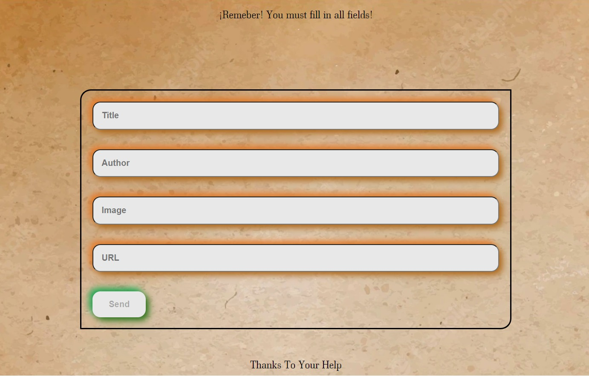

# Here comes the news books news! 🌞📰

On this page, you can find the latest books that have been released and where to buy them.

## Technologies used 💻

- ❖ Context
- ❖ SASS
- ❖ React

## Home

In the main page, you can see reflected the information of the books, with its author and the link to be able to buy.

## Form

On the Add News Books page, you will be able to participate in our site, registering new books, you will have to fill in all information

## The best and the worst 😘😒

The best thing, as always, is to gain knowledge, play with what SASS has to offer and see how each component works.

The worst, being something totally new, we can find several bugs, which will be fixed in the future, and may be reflected in how our page looks like

